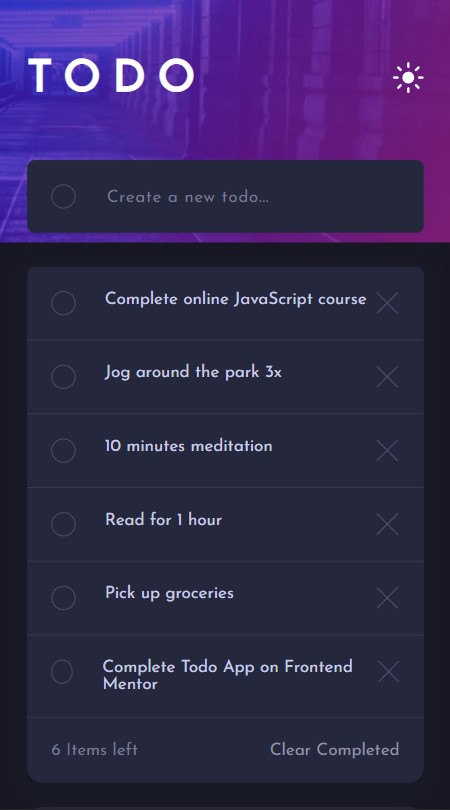

# Frontend Mentor - Todo app solution

This is a solution to the [Todo app challenge on Frontend Mentor](https://www.frontendmentor.io/challenges/todo-app-Su1_KokOW). 

## Table of contents

- [Overview](#overview)
  - [The challenge](#the-challenge)
  - [Screenshot](#screenshot)
  - [Links](#links)
- [My process](#my-process)
  - [Built with](#built-with)
  - [What I learned](#what-i-learned)
  - [Useful resources](#useful-resources)
- [Author](#author)

## Overview

### The challenge

Users should be able to:

- View the optimal layout for the app depending on their device's screen size
- See hover states for all interactive elements on the page
- Add new todos to the list
- Mark todos as complete
- Delete todos from the list
- Filter by all/active/complete todos
- Clear all completed todos
- Toggle light and dark mode
- **Bonus**: Drag and drop to reorder items on the list

### Screenshot

### Links

- Solution URL: [github.com/AleksandraPetryka/Todo-app](https://github.com/AleksandraPetryka/Todo-app)
- Live Site URL: [aleksandrapetryka.github.io/Todo-app/](https://aleksandrapetryka.github.io/Todo-app/)

## My process

### Built with

- Semantic HTML5 markup
- SCSS
- Flexbox
- CSS Grid
- [React](https://reactjs.org/) - JS library
- React Hooks - useState, useEffect, useRef, useContext
- TypeScript

### What I learned
- Understanding of TypeScript with React.
- How to use React Hooks especially useState, useEffect, useRef.
- How to use Context API as global data in functional components.

### Useful resources

- [Flexbox Froggy](https://flexboxfroggy.com/#pl) - This helped me finally understand Flexbox CSS. I'd recommend it to anyone still learning this concept.

## Author

- Frontend Mentor - [@aleksandrapetryka](https://www.frontendmentor.io/profile/aleksandrapetryka)